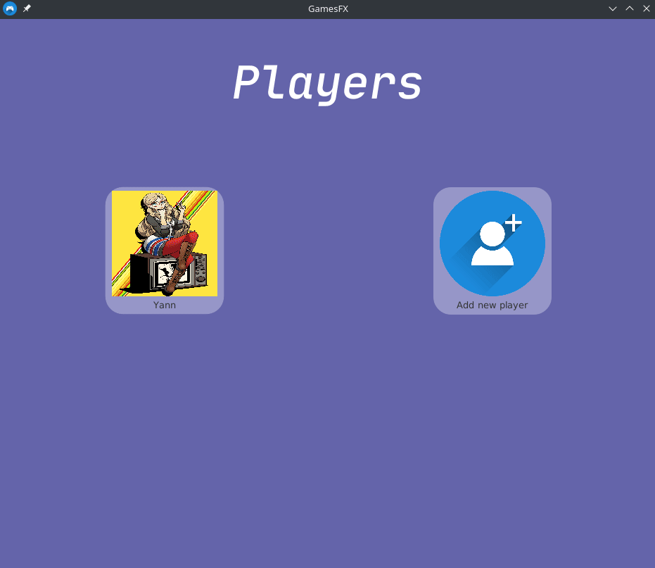
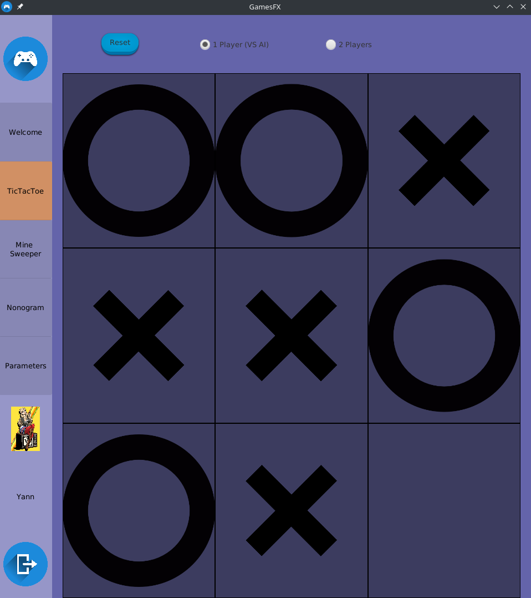
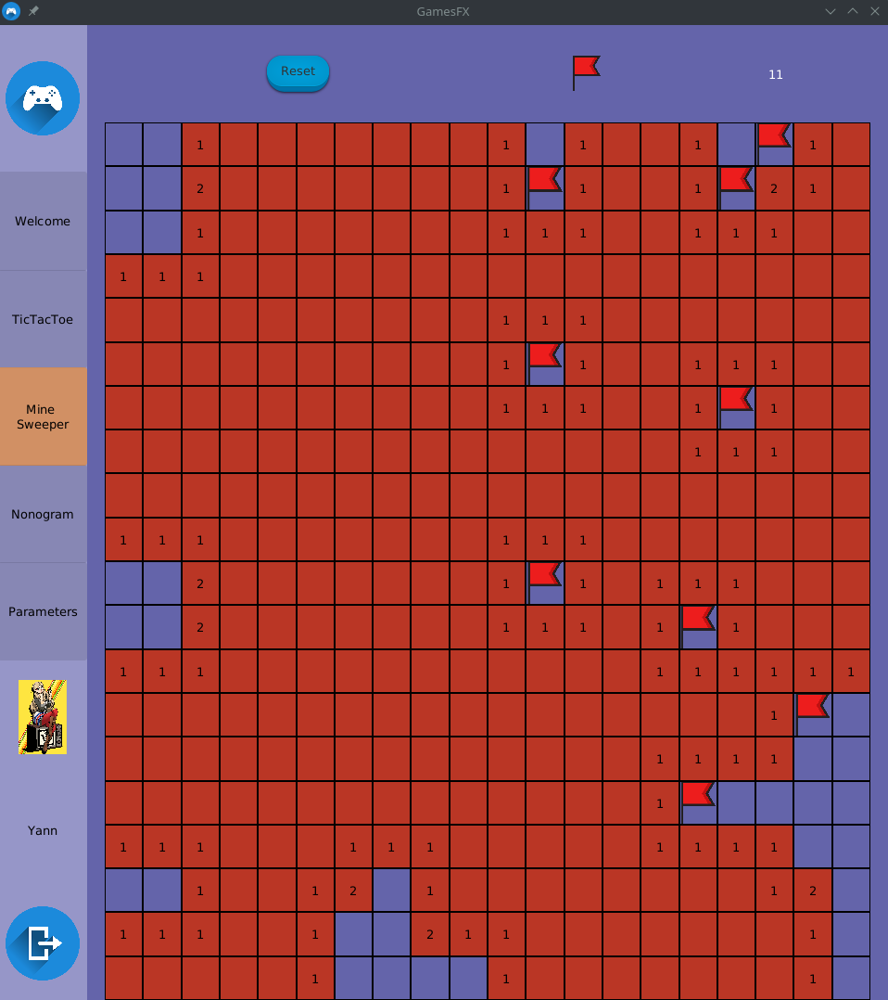
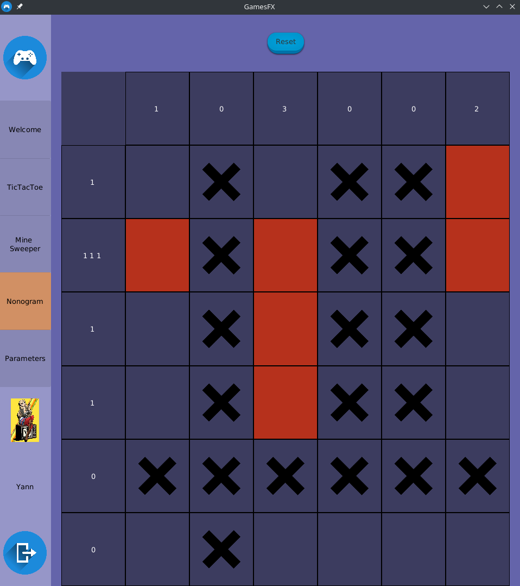

# GamesFX

In this soft, you have 3 games. 
* TicTacToe
* Minesweeper
* Nonogram

## TicTacToe

You can play at TicTacToe with your friends or with a computer (minimax algorithm).

## Minesweeper 

Classic minesweeper. You can change width and height in parameters.

## Nonogram

Random nonogram generation. You can change width and height in parameters.

## Require

For use this project Java8 is needed.